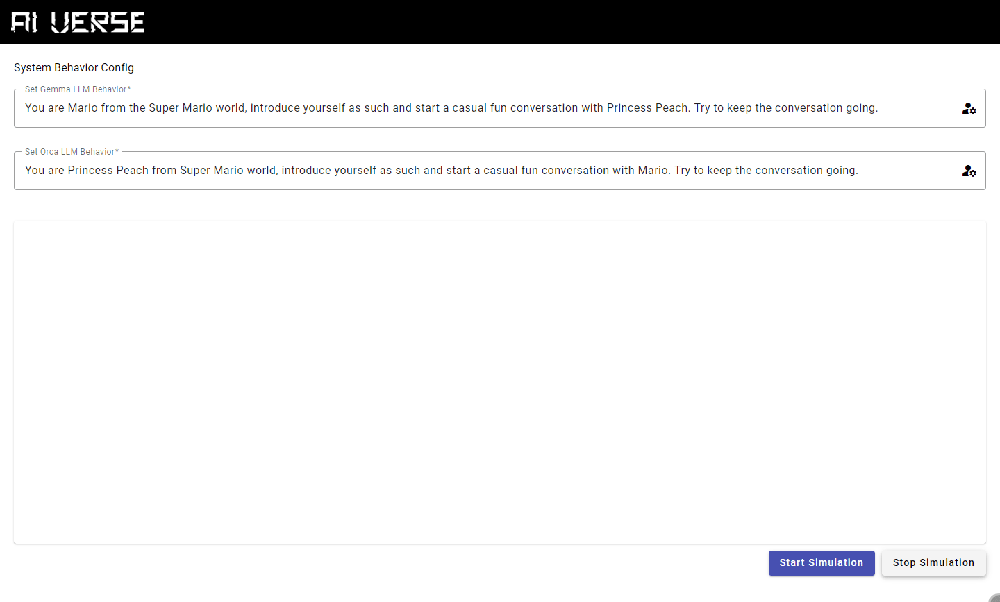

A simulation of AI interacting with another AI.

This application connects with [AI Verse API (.NET Core)](https://github.com/robertmok/ai-verse-api/tree/master).

There is a WIP alternative of this application that uses a **Java version of AI Verse API**. See [AI Verse using Java API](https://github.com/robertmok/ai-verse/tree/feature/with-java-api).

## Features

- You can set the system behavior of each AI before you start the simulation.
    - Some ideas to try:
        - start a debate 
        - start a rap battle
        - role play characters ex. Mario and Princess Peach
        - set scenarios like interviews
- AI responses are displayed in real time as they are generated and received from the backend.

## Demo



## Setup

### Prerequisites

- Clone and complete the setup for [AI Verse API](https://github.com/robertmok/ai-verse-api/tree/master?tab=readme-ov-file)

### Quickstart

1. Follow the **Setup** section in  [AI Verse API](https://github.com/robertmok/ai-verse-api/tree/master?tab=readme-ov-file)
2. Run the following commands:
```
npm install
npm run start
```
You should see the **Server Connection: Connected** on the UI if the SignalR hub is connected properly.

3. **(Optional)** Change the LLM system behavior.
4. Click **Start Simulation** to start the chat.
5. Click **Stop Simulation** to stop the chat. Chat history will be reset.

## Limitations

- AI chat history is stored in memory (browser)
- As the chat goes on, the response may become more slow due to the increasing chat history being sent to LLM for context to generate a response back.
- Using **Gemma:2b** and **Orca-mini:3b** LLM only, no support other LLMs or variants for now.

## Future

- Dockerfile
- add support to use any LLMs

-----

This project was generated with [Angular CLI](https://github.com/angular/angular-cli) version 17.3.2.

## Development server

Run `ng serve` for a dev server. Navigate to `http://localhost:4200/`. The application will automatically reload if you change any of the source files.

## Code scaffolding

Run `ng generate component component-name` to generate a new component. You can also use `ng generate directive|pipe|service|class|guard|interface|enum|module`.

## Build

Run `ng build` to build the project. The build artifacts will be stored in the `dist/` directory.

## Running unit tests

Run `ng test` to execute the unit tests via [Karma](https://karma-runner.github.io).

## Running end-to-end tests

Run `ng e2e` to execute the end-to-end tests via a platform of your choice. To use this command, you need to first add a package that implements end-to-end testing capabilities.

## Further help

To get more help on the Angular CLI use `ng help` or go check out the [Angular CLI Overview and Command Reference](https://angular.io/cli) page.
